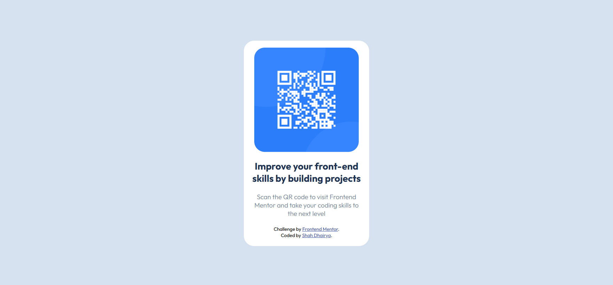

# Frontend Mentor - QR code component solution

This is a solution to the [QR code component challenge on Frontend Mentor](https://www.frontendmentor.io/challenges/qr-code-component-iux_sIO_H). Frontend Mentor challenges help you improve your coding skills by building realistic projects. 

## Table of contents

  - [Screenshot](#screenshot)
  - [Links](#links)
  - [Built with](#built-with)
  - [Useful resources](#useful-resources)
  - [AI Collaboration](#ai-collaboration)
  - [Author](#author)

### Screenshot

### Links

- Solution URL: [Add solution URL here](https://your-solution-url.com)
- Live Site URL: [Add live site URL here](https://your-live-site-url.com)

### Built with

- Semantic HTML5 markup
- CSS custom properties
- Flexbox

### Useful resources

- [Example resource 1](https://www.google.com) - This helped me for getting right CSS properties.

### AI Collaboration

I used VS code Copilot for this challenge.

- First, I gave it the reference of Claude.md file so that it does not provide me any handy code to just copy/paste.
- I just understand the instructions that copilot provided me to match the solution to the challenge design.
- AS I already have knowledge of HTML and CSS , I am able to do all the stuff by myself and if i got stuck anywhere than I google for the appropriate guidance and not the full copy/paste.

## Author

- Frontend Mentor - [@Dhairya5115](https://www.frontendmentor.io/profile/Dhairya5115)

